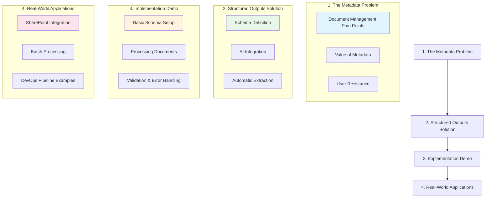

# Demo Notebook Plan: AI-Powered Metadata Extraction

## Overview

This notebook demonstrates how to use AI for automatic metadata extraction from documents, focusing on practical applications in document management systems like SharePoint where manual metadata entry is a common pain point.

## Structure

## Detailed Sections

### 1. The Metadata Problem
- Overview of document management systems (SharePoint focus)
- The value of metadata
  * Improved searchability
  * Better organization
  * Automation capabilities
- Why users resist filling in metadata
  * Time consumption
  * Unclear field purposes
  * Complexity of choices
- Cost of poor metadata
  * Time lost searching
  * Duplicate content
  * Missed automation opportunities

### 2. Structured Outputs as a Solution
- What are structured outputs
  * Comparison with chat interfaces
  * Predictable, validated format
  * Integration-ready
- Schema definition
  * Required fields
  * Validation rules
  * Flexible formats
- Automatic extraction process
  * Zero user input required
  * Consistent results
  * Error handling
- Provider flexibility
  * OpenAI
  * Azure OpenAI
  * GitHub Models

### 3. Implementation Demo
- Simple schema definition
  * Basic metadata fields
  * Validation rules
  * Required vs optional
- Processing documents
  * Single document example
  * Multiple format support
  * Content extraction
- Schema validation
  * Error types
  * Handling edge cases
  * Quality assurance

### 4. Real-World Applications
- SharePoint integration
  * Column mapping
  * Automatic tagging
  * Search improvements
- Batch processing
  * Handling existing documents
  * Performance considerations
  * Monitoring and logging
- DevOps pipeline integration
  * Automated workflows
  * CI/CD integration
  * Scaling considerations

## Key Differentiators

- Zero user input required for metadata
- Consistent, validated outputs
- Scales to batch processing
- Integrates with existing systems

## Implementation Notes

The notebook will use legal documents as examples but emphasize that the same approach works for any document type where automatic metadata extraction would be valuable. The focus is on showing practical value through structured outputs rather than conversational AI interactions.